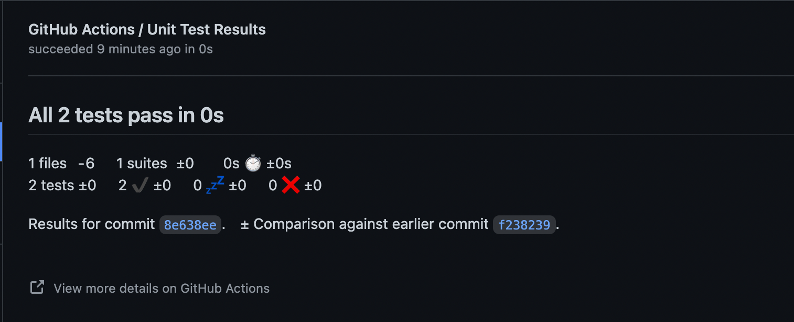

## Extend pipeline 

Once a test step has been added to the pipeline it would be nice to see the results of the tests without having to dig through output of the individual steps in Github Actions .

To show test results in Github Actions use the following syntax:

```YAML
    - name: Publish Unit Test Results
      uses: EnricoMi/publish-unit-test-result-action@v1
      if: always()
      with:
        files: app/build/test-results/**
```

### Tasks

* make a second `- run:` step with the command `ci/unit-test-app.sh`.
* publish the outputted test results

> Hint: The results of running `ci/unit-test-app.sh` are stored in a local directory: `app/build/test-results`.

The outputted test resuts can be seen if pull request will be created towards another branch. It will look like: 

