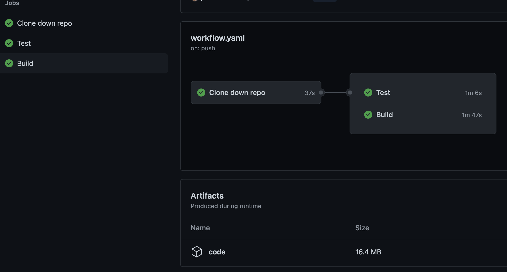

## Workflow

When you have larger or more complex projects, you’ll want separate jobs to do separate things (i.e. build vs. test). Despite the fact our example project is super simple, we will divide the workload to demonstrate the functionality.

Up until now, we have had a job called `build` both for the build and test, but that is not really the correct phrasing. The only reason we have done this, is because Github Actions **requires** you to have one job called `build`

So far we have only had one "job" called build even though it now has multiple steps.

It is also possible to use multiple jobs, organized in a what Github Actions calls a Workflow.

To use workflows we first have to define the jobs, i.e.:

```YAML
jobs:
  my_first_job:
    name: My first job
  my_second_job:
    name: My second job
```

However, this simple example just runs the two jobs simultaneously, which is often not what we want.

Luckily, workflows let us do things like sequential flows, fan out, fan in and so on.

To run the two job sequentially we define a workflow where job-2 "requires" job-1 to have run before it starts.

```YAML
name: workflow
jobs:
  job-1:
  job-2:
    needs: job-1
```
This also ensures that  `job-2 ` is not run if  `job-1 ` fails. It is possible to add name to workflow fx. here: `name: workflow`

It is also possible to filter on branch names. This is useful to create a flow, where different branches go trough different jobs. For instance  `feature/*` branches could be tested, while the  `master` branch is both tested and an artifact is created and stored.

```YAML
jobs:
  test_feature:
    - name: Only when feature branch is pushed
      if:   github.event_name == 'push' && github.ref == 'refs/heads/feature/*'
      uses: some/action
  test_and_build_master:
    - name: Only when master is pushed
      if:   github.event_name == 'push' && github.ref == 'refs/heads/master'
      uses: some/action
```

To ensure that all files from previous jobs are avalable at new one, we have to make sure to upload artifact at the end of the job and download it at the beginning of new one. The way to do it can be found in previous exercise `04-storing-artifacts.md`.

### Tasks
Let's try to clean up our current build by utilizing a feature called workflows.

1. Make another job in the `.github/workflows/workflow.yaml`, that is a plain copy of the previous one.
2. Add workflow name `Java CI`
3. Divide code into three jobs: `Clone-down`, `Test` and `Build`. `Clone-down` will checkout the repository, `Test` job runs the tests for code, `Build` will build the code and stores the results. 
3. `Test` and `Build` should be dependent on `Clone-down` job. Each of them also needs a running instance and container.
4. Remember that to have information from previous job(s) the artifact with this information needs to be downloaded and respectively uploaded.


Opening it should show something like:



More information about this topic can be found here: https://docs.github.com/en/actions/reference/workflow-syntax-for-github-actions