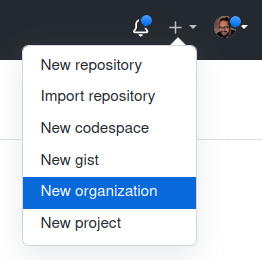
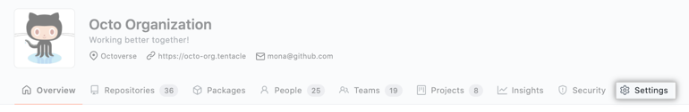
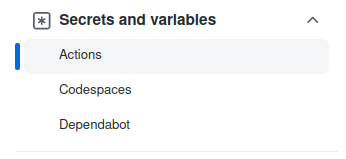

## Starter Workflows & Organizational Sharing

### **Starter Workflows**

- **What:** Starter workflows allow everyone in your organization who has permission to create workflows to do so more quickly and easily.

- **Why?**
    - Saves time
    - Promotes consistency
    - Serves as an exemplar for following best practices

### Task

Let's dive 🤿 in and create an organization, a starter workflow, and then run it! 🏃‍♀️

- Go to github.com and create a new organization from the `+` dropdown menu


- Select the free tier option ("create a free organization").
- Set the organization name to anything you wish (must be unique across Github), and use your email for the contact.
- Set `this organization belongs to` "My personal account".
- Attempt to prove you're not a robot 🤖🖼️ (good luck).
- Accept the TOS and click next.
- On the Welcome page click `skip this step` on the bottom.
- Click the submit option on the bottom of the page to bypass the survey information.
- Click the `Repository` tab.
- Create a new repository.
- Choose `.github` as the repository name (*required in order to make the 🪄 work*).
- 📝 Set visibility to public 👀
- Click the `Create repositiory` button on the bottom.
- Create a directory named `workflow-templates`.

<details>
    <summary>Create a `/workflow-templates/my-org-ci.yml` file</summary>

```YAML
name: Octo Organization CI

on:
  push:
    branches: [ $default-branch ]
  pull_request:
    branches: [ $default-branch ]

jobs:
  build:
    runs-on: ubuntu-latest

    steps:
      - uses: actions/checkout@v3

      - name: Run a one-line script
        run: echo Hello from Octo Organization
```
</details>

<details>
    <summary>Create a `/workflow-templates/my-org.properties.json` file</summary>

```JSON
{
    "name": "Octo Organization Workflow",
    "description": "Octo Organization CI starter workflow.",
    "iconName": "example-icon",
    "categories": [
        "node", "js"
    ],
    "filePatterns": [
        "package.json$",
        "^Dockerfile",
        ".*\\.md$",
        ".*\.ya?ml"
    ]
}
```
</details>

---
## Using the Starter Workflow

- Go to the Actions tab on the .github (or any repo owned by the org) and you should see a section "By Organization name"

Click configure.

Click start commit.

Commit to main branch (create new file).

Go back to Actions and click on build and then you should see the steps.

---
## Organizational Sharing

- Assets that can be shared organization wide: 
  - starter workflows (as above)
  - secrets & variables
    - Navigate to main organization page and click on settings

    - Find the `Secrets and variables` section, expand, and click `Actions`


## Resources

[Creating](https://docs.github.com/en/actions/using-workflows/creating-starter-workflows-for-your-organization) starter workflows

[Using](https://docs.github.com/en/actions/using-workflows/using-starter-workflows) starter workflows

[Organizational sharing](https://docs.github.com/en/actions/using-workflows/sharing-workflows-secrets-and-runners-with-your-organization) - workflows, variables, secrets
