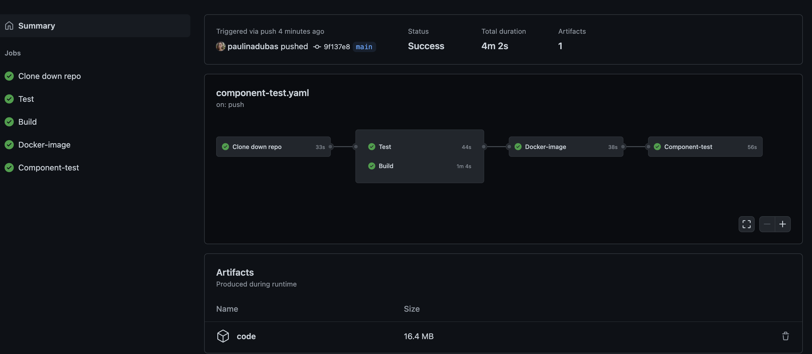

## Component test

After running `unit test` in exercise 2, now the time came to run `component test`, that requires your docker username and password as env, and a `ci/component-test.sh` script that runs a docker-compose file with component tests.

## Tasks

- Add job named `Component-test`, which will run `ci/component-test.sh` script that runs a docker-compose file with component tests.

```bash
#! /bin/bash
[[ -z "${docker_username}" ]] && DockerRepo='' || DockerRepo="${docker_username}/"
docker_username=$DockerRepo docker-compose -f component-test/docker-compose.yml --project-directory . -p ci up --build --exit-code-from test
```

```YAML
- name: Execute component test
  run: chmod +x ci/component-test.sh && GIT_COMMIT="GA-$GITHUB_SHA" && ci/component-test.sh
```

___
- This job needs to be dependent on `Docker-image` job.

```YAML
needs: [Docker-image]
```


### Solution
If you strugle and need to see the whole ***Solution*** you can extend the section below. 
<details>
    <summary> Solution </summary>
  
```YAML
  Component-test:
    runs-on: ubuntu-latest
    needs: Docker-image
    steps:
    - name: Download code
      uses: actions/download-artifact@v1
      with:
        name: code
        path: .
    - name: Execute component test
      run: chmod +x ci/component-test.sh && GIT_COMMIT="GA-$GITHUB_SHA" && ci/component-test.sh
```
  
</details>

### Results

If you added the job succesfully, your pipeline should look like:

