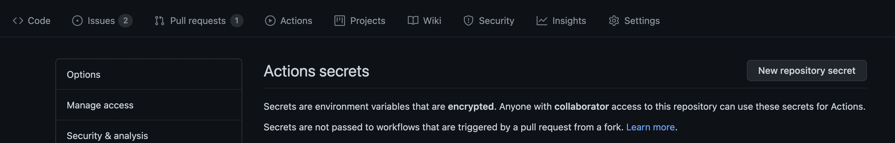
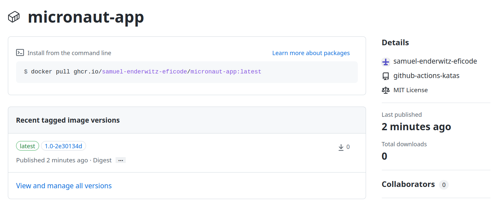

# Building Docker Images

Next step is to have our application packaged as a docker image for easy distribution. 

We have some requirements for our pipeline step:

- Should build our application as a docker image.
- Should tag the image with both the git sha and "latest". (Never use such general tags in real life!)
- Should push the image to docker registry.

In order for this to work, we need three environment variables:
- `docker_username` the username for docker registry.
- `docker_password` the password for docker registry.
- `GIT_COMMIT`  the name of the git commit that is being built.

You can set these environment variables as global variables in your workflow through the `env` section.

```YAML
env:
  docker_username: <your docker username>
  docker_password: <your docker password>
  GIT_COMMIT: <your git commit>
```

The two scripts: `ci/build-docker.sh` and `ci/push-docker.sh` expects all three environment variables to be set.

## Build-in environment variables

Many of the common information pieces for a build is set in default environment variables.

Examples of these are:

- The name of the repository
- The name of the branch
- The SHA of the commit

You can see the ones you can use directly inside a step here: https://docs.github.com/en/actions/learn-github-actions/environment-variables#default-environment-variables

Github Actions also has a list of contexts.

Contexts are a way to access information about workflow runs, runner environments, jobs, and steps. 
Each context is an object that contains properties, which can be strings or other objects.
You can see them here: https://docs.github.com/en/actions/learn-github-actions/contexts#about-contexts 

The default environment variables that GitHub sets are available to every step in a workflow.
Contexts are also available before the steps, as when defining the `env` section of the workflow. 


### Tasks

<!-- - To start Docker credentials should be stored as repository secrets at Github Actions Repository. Please go to `Settings > Secrets > New repository secret` to add them. 

 -->

- Add a new job named `Docker-image` that requires the `Build` to be completed.
You need to add package write permissions so that your action can upload the container to the registry.

```YAML
  Docker-image:
    runs-on: ubuntu-latest
    needs: [Build]
    permissions:
      packages: write
```

In order for us to create and push the docker image, we need the CI scripts, the Dockerfile and the Artifact. All of them are present in the `code` artifact created in the last exercise.

- Add a step in `Docker-image` which downloads the `code` artifact.


<details>
    <summary> :bulb: Hint on how it looks like </summary>

```YAML
    - name: Download code
      uses: actions/download-artifact@v3
      with:
        name: code
        path: .
```
</details>

- Add `docker_username` and `docker_password` as environmental variables on top of the workflow file. 

```YAML
env:
  docker_username: ${{ github.actor }}
  docker_password: ${{ secrets.GITHUB_TOKEN }}
```

- Add GIT_COMMIT environment variable as well. 

Tip! it needs the same "wrapping" (`${{}}`) as the other environment variables, and can be found in the `github` context

- Run the `ci/build-docker.sh` and `ci/push-docker.sh` scripts.

Ready steps looks like:
```YAML
    - name: build docker
      run: chmod +x ci/build-docker.sh && ci/build-docker.sh
    - name: push docker
      run: chmod +x ci/push-docker.sh && ci/push-docker.sh
```

> Hint: Remember that the job needs to run on specified system and is based on the results from previous jobs.

- See that the image is built and pushed to the GitHub container registry.

## Using actions instead of scrtipts

The above job can be also done by using actions: `docker/login-action@v3` and `docker/build-push-action@v5`, what will provide the same functionality. You can find it in the example below:

```yaml
on: push
jobs:
  build-and-push-latest:
    runs-on: ubuntu-latest
    permissions:
      packages: write
    steps:
      - name: Login to DockerHub
        uses: docker/login-action@v3
        with:
          registry: ghcr.io
          username: ${{ github.actor }}
          password: ${{ secrets.GITHUB_TOKEN }}
      - name: Build and push
        uses: docker/build-push-action@v5
        with:
          context: app
          push: true
          tags: ghcr.io/${{ github.actor }}/micronaut-app:1.0-${{ github.sha }},ghcr.io/${{ github.actor }}/micronaut-app:latest
```

### Solution 
If you strugle and need to see the whole ***Solution*** you can extend the section below. 
<details>
    <summary> Solution </summary>
  
```YAML
name: Main workflow
on: push
env: # Set the secret as an input
  docker_username: ${{ github.actor }}
  docker_password: ${{ secrets.GITHUB_TOKEN }}
  GIT_COMMIT: ${{ github.sha }}
jobs:
  Build:
    runs-on: ubuntu-latest
    container: gradle:6-jdk11
    steps:
      - name: Clone down repository
        uses: actions/checkout@v4       
      - name: Build application
        run: ci/build-app.sh
      - name: Test
        run: ci/unit-test-app.sh
  Docker-image:
    runs-on: ubuntu-latest
    needs: [Build]
    permissions:
      packages: write
    steps:
    - name: Download code
      uses: actions/download-artifact@v3
      with:
        name: code
        path: .
    - name: build docker
      run: ci/build-docker.sh
    - name: push docker
      run: ci/push-docker.sh
```

</details>


### Results

You should be able to see your docker image on your GitHub account as: 



