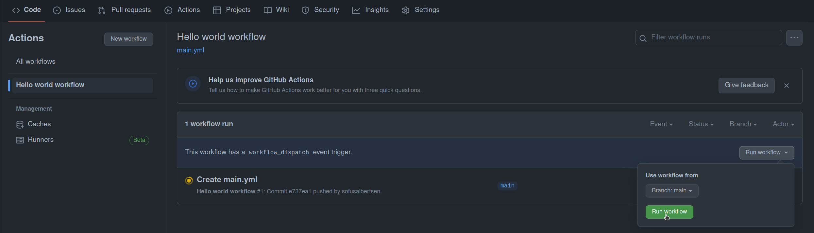

## Making your first "hello world" pipeline

Github Actions is configured through the [YAML files](https://docs.github.com/en/actions/using-workflows/workflow-syntax-for-github-actions).

:bulb: The trickiest part of writing the configuration files is typically getting the indentation right.

### learning goals

- Understand the basic structure of a workflow file
- Understand the basic structure of a job
- Understand the basic structure of a step

### A basic example:

Now we want to diver a bit more into a pipeline.

Examine the following example, that makes the agent running the pipeline echo out "hello world":


```yaml
name: Hello world workflow
on: 
  push:
  workflow_dispatch:
jobs:
  my-job:
    runs-on: ubuntu-latest
    steps:
      - run: |
          echo "🎉 The job was triggered by event: ${{ github.event_name }}"
          echo "🔎 The name of your branch is ${{ github.ref }} and your repository is ."

      - uses: actions/checkout@v4

      - name: List files in the repository
        run: |
          echo "The repository ${{ github.repository }} contains the following files:"
          tree
```

A line-by-line explanation of the above:

- **Line 1**: Specifies the name of the workflow, in this case, "Hello world workflow".
- **Line 2-4**: The workflow is triggered by a `push` event or a manual trigger.
- **Line 5**: Introduces the `jobs` section where all job definitions reside.
- **Line 6-7**: Defines a job named `my-job` that runs on an Ubuntu VM.
- **Line 8-11**: First step in `my-job` prints out the event that triggered the workflow and the reference of the branch using `github.event_name` and `github.ref`.
- **Line 13**: Checks out the repository's content to the runner, enabling subsequent steps to access it.
- **Line 15-18**: Lists and displays the directory structure of the checked-out repository using the `tree` command.

This workflow is a basic example that provides insights into the event type, branch reference, and repository structure when code is pushed to it.

## Task

- Replase the workflow you created in `.github/workflows/main.yml` with the above example.
- Add and commit the file and push it to Github. 

<details>
<summary>:bulb: Git commands to do it if you are using the terminal</summary>

```bash
git add .github/workflows/hello-world.yml
git commit -m "Add hello world workflow"
git push

```

</details>

- Go to Github Actions tab of the repository and check the action status.

## Results

You should see something like this in the logs of Github Actions: (Note: The logs can be a bit hard to find the first time, but give it a shot)

```bash
#!/bin/sh -eo pipefail
echo 'Hello World!'

Hello World!
```

**Manually triggering the workflow**

You can also trigger the workflow manually by clicking the `Run workflow` button.



- Click on the `Run workflow` button and click `Run workflow` again in the popup.
- Go to the `Actions` tab and see the workflow running again, this time with the `workflow_dispatch` event.


## Summary
Congratulations! 

You have successfully created the first Github Actions workflow, and ran it successfully :tada:.
