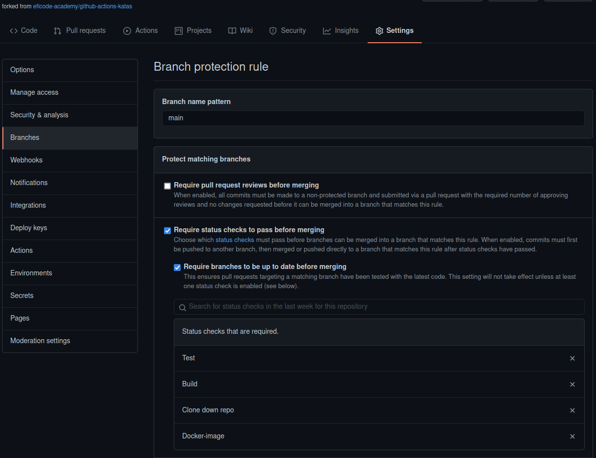
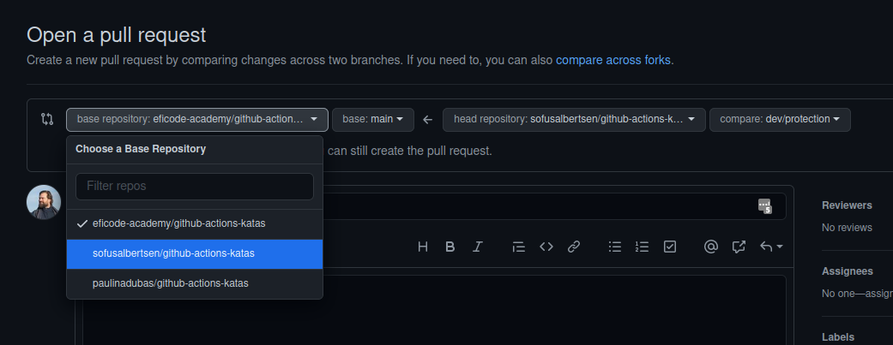
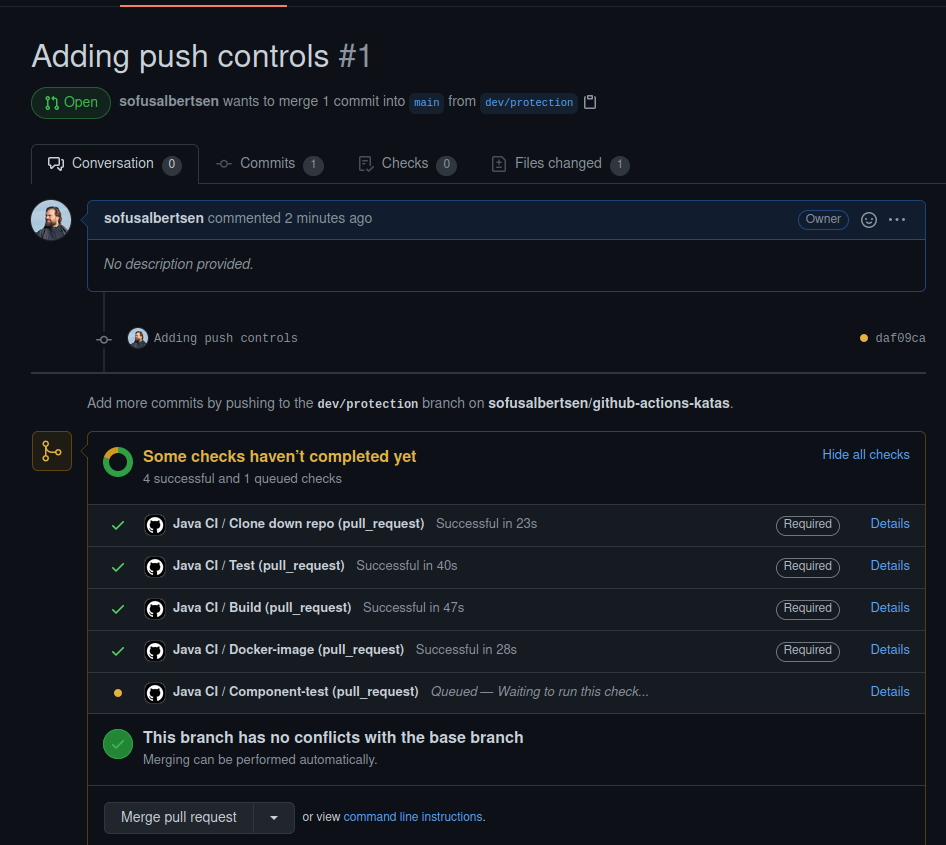

# Pull Request based workflow

> Note: In this exercise we use the term "main" to refer to the main stabilization branch, or the default branch. This can also have the name "trunk" or "master", but all is refering back to the same thing.

The defacto-standard workflow now-adays is the
Pull Request workflow (also known as the
[GitHub flow](https://guides.github.com/introduction/flow/))

It utilizes the pull request feature to merge code from developer branches to main.

## Securing your main branch



We do not want everybody to be able to push
directly to main, without the CI server checking
the quality of the code. So we need our Git
repository to block incoming pushes directly to
main. In that way we can ensure that the only
way in to main is through a PR. This can be done
in
[GitHub](https://help.github.com/en/github/administering-a-repository/enabling-required-status-checks)
under `settings->Branches`, Branch protection
rules and then click on `add rule`.

### Tasks

- Go to your repository on GitHub enter settings.
- Go to `Branches` and add a branch protection rule.
- Give it the pattern `main`.
- `Require status checks to pass before merging`
  Will block the pull request from merging until
  the tests have passed.
- `Require branches to be up to date before merging`
  The branch must be up to date with the base
  branch before merging.
- Add the following jobs to the `Status checks that are required` selection: `Test`,`Build`,`Docker-image`. In that way, no one can push to main without having the tests pass.
- `Do not allow bypassing the above settings ` Makes the rules apply
  to everyone (yes, you too!).
- OPTIONAL: `Require linear history` requires the
  PR branch to be rebased with the target branch,
  so a linear history can be obtained.
  [Further explanaition here](https://www.bitsnbites.eu/a-tidy-linear-git-history/).
  This is a very strict way of using git, and is
  only here for inspiration for experiments.

- Try to push to main to verify that you cannot.

## Triggering the build on a PR

So how do we then get the CI server to run the tests on a PR?
Right now our pipeline gets triggered by any push to any branch.

We want our pipeline to trigger on both pushes and pull requests towards main only.

The way thar pipelines gets triggered is by using the `on` field in the workflow.

### Tasks

- Take a look at the [documentation on what events that can trigger a pipeline](https://docs.github.com/en/actions/reference/events-that-trigger-workflows).

- By using the resource above, make the pipleine only trigger on pushes and PR's to `main` branch.

<details>
<summary> Hint if you get stuck</summary>

``` yaml
on:
  # Trigger the workflow on push or pull request,
  # but only for the main branch
  push:
    branches:
      - main
  pull_request:
    branches:
      - main
```

</details>

- Try to make a couple of different branches that you push up to github and make pull requests on. It could be that you in one broke the unit tests to see that the CI system caught that, and another where you make your branch diverge from what is on main now, triggering the build-in github rules.

> Note: When you make a pull request on your
> forked repository, GitHub will make target
> branch the main of _the original repo_. You
> need to change it manually to make the pull
> request based on your fork.
>
> 

Looking at your pull requests, you should see that the pipeline is triggered for each of them, and that only if the tests are passing that you can merge the PR.

]

## What about the rest?

You want to run tests on your development branches as well, even if you are not pushing to main right away.

For that we need to add another workflow to the repository.

We want to run a slightly shorter workflow, excluding the component and performance tests, and the push of docker images. 

We want to run in on all branches that has the prefix `dev/`.

### tasks

- Copy your workflow file to a new file called `workflows/dev-workflow.yml`.
- Change the `on` field to:

``` yaml
on:
  push:
    branches:
      - "dev/**"
```

- delete the `Component-test:` job and the `Performance-test:` jab from the `jobs` section.
- delete the `name: push docker` step from the `Docker-image` job.

## Trying it out

Congratulations! If everything works as intended,
you now have a full "grown up" pipeline, with
conditions, and security that your main branch
always contains tested code. Go ahead and try it
out, to see what it feels like.

## Further reading

- https://docs.github.com/en/actions/reference/events-that-trigger-workflows
