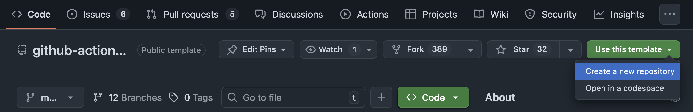
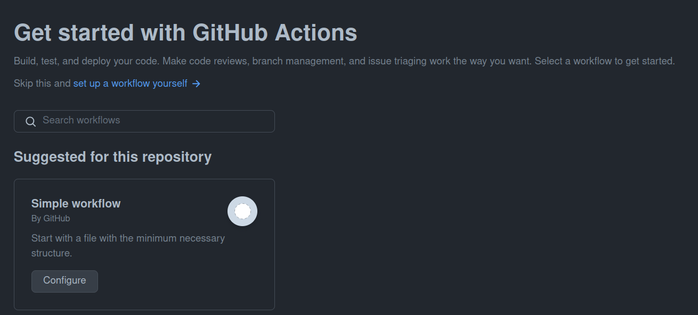

# Github Actions Katas

This series of katas will go through the basic steps in github actions, making you able to make CI builds in the end.

## Learning Goals

- Creating an instance of the template repository
- Creating a workflow file seeing Github Actions in action

## Exercise

### Overview

In this exercise we are creating your own instance of this templated repository, and creating a workflow.

<details>
<summary>:bulb: If you want to clone this down on your machine, you need to have git set up there. Here are the commands to set it up</summary>

You need to provide your email and name to git with the following commands.

``` bash
git config --global user.email "you@example.com"
git config --global user.name "Your Name"
```

When you do a git clone, then you will be asked for your username and password. If you want to avoid that, you can set up an ssh key. [Here is a guide on how to do that](https://help.github.com/en/github/authenticating-to-github/connecting-to-github-with-ssh).  It will take you 5-10 minutes though, so if you are in a hurry, just use the username and password.

</details>

### Tasks

#### Creating a repository

-  Go to Code tab of this repository and click `Use this template`



-  Select your GitHub user as the owner and name the repository. Leave the repo public to have unlimited action minutes.

> :bulb: **From this point forward, all actions should be performed in the repository you just created, not the template repository**

#### Creating the workflow

As a general rule, all your workflow files will be located in the `.github/workflows` folder.

- Click on the `Actions` tab and click `New workflow`

- Click on the "setup the workflow yourself" link



- The file `.github/workflows/main.yaml` should have the following workflow:

``` yaml
# This is a basic workflow to help you get started with Actions

name: CI

# Controls when the workflow will run
on:
  # Triggers the workflow on push or pull request events but only for the "main" branch
  push:
    branches: [ "main" ]
  pull_request:
    branches: [ "main" ]

  # Allows you to run this workflow manually from the Actions tab
  workflow_dispatch:

# A workflow run is made up of one or more jobs that can run sequentially or in parallel
jobs:
  # This workflow contains a single job called "build"
  build:
    # The type of runner that the job will run on
    runs-on: ubuntu-latest

    # Steps represent a sequence of tasks that will be executed as part of the job
    steps:
      # Checks-out your repository under $GITHUB_WORKSPACE, so your job can access it
      - uses: actions/checkout@v4

      # Runs a single command using the runners shell
      - name: Run a one-line script
        run: echo Hello, world!

      # Runs a set of commands using the runners shell
      - name: Run a multi-line script
        run: |
          echo Add other actions to build,
          echo test, and deploy your project.
```

- click `Commit changes` and commit to the main branch
- Go to the `Actions` tab and see the workflow running
- Click on the workflow and see the output of the workflow

## Summary

Congratulations! You have now created your first workflow!
It does not do much, but in the next exercise we will start building on it.

