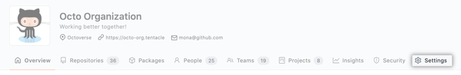
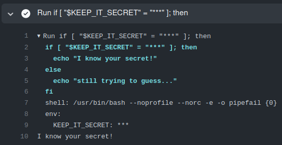

## Starter Workflows & Organizational Sharing

### **Starter Workflows**

- **What:** Starter workflows allow everyone in your organization who has permission to create workflows to do so more quickly and easily.

- **Why?**
    - Saves time
    - Promotes consistency
    - Serves as an exemplar for following best practices

### **Task**

Let's dive in and create an organization, a starter workflow, and then run it!

- Go to github.com and create a new organization from the `+` dropdown menu


- Select the free tier option ("create a free organization").
- Set the organization name to anything you wish (must be unique across Github), and use your email for the contact.
- Set `this organization belongs to` "My personal account".
- Solve the captcha / robot detector test.
- Accept the TOS and click next.
- On the Welcome page click `skip this step` on the bottom.
- Click the submit option on the bottom of the page to bypass the survey information.
- Click the `Repository` tab.
- Create a new repository.
- Choose `.github` as the repository name (*required in order to make the magic work*).
- 📝 Set visibility to public
- Click the `Create repositiory` button on the bottom.
- Create a directory named `workflow-templates`.

<details>
    <summary>Create a file named /workflow-templates/my-org-ci.yml</summary>

```YAML
name: Octo Organization CI

on:
  push:
    branches: [ $default-branch ]
  pull_request:
    branches: [ $default-branch ]

jobs:
  build:
    runs-on: ubuntu-latest

    steps:
      - uses: actions/checkout@v3

      - name: Run a one-line script
        run: echo Hello from Octo Organization
```
</details>

<details>
    <summary>Create a file named /workflow-templates/my-org-ci.properties.json</summary>

```JSON
{
    "name": "Octo Organization Workflow",
    "description": "Octo Organization CI starter workflow.",
    "iconName": "example-icon",
    "categories": [
        "node", "js"
    ],
    "filePatterns": [
        "package.json$",
        "^Dockerfile",
        ".*\\.md$",
        ".*\.ya?ml"
    ]
}
```
</details>

---
## Using the Starter Workflow

- Go to the Actions tab on the .github (or any repo owned by the org) and you should see a section "By Organization name"

Click configure.

Click start commit.

Commit to main branch (create new file).

Go back to Actions and click on build and then you should see the steps.

---
## Organizational Sharing

  Assets that can be shared organization wide: 
  - starter workflows (as above)
  - self-hosted runners (covered in the lab [here](09-selfhosted-runner.md)
  - secrets & variables<br><br>
    ### **Task - add a organization level variable or secret** 
    - Navigate to main organization page and click on `Settings`
  
      

    - Find the `Secrets and variables` section, expand, and click `Actions`

      
    - Notice the top tab allows you to select between a secret (default) and a variable
    - Click the *New organization secret* button
    - Select a `Name` and `Value`, and observe that you can scope the secret to public (the default for some reason ), private, or selected repos within the organization
    - Note that secrets are redacted (with `***`) from log outputs, so in order to verify access, try a workflow simlar to the following:

      Verify secret access `/.github/workflows/test-secret.yaml`
        ```YAML
        name: Access Organization Secret
          on:
            push:
          jobs:
            test-secret:
              runs-on: ubuntu-latest
              steps:
                - shell: bash
                  env:
                    KEEP_IT_SECRET: ${{ secrets.KEEP_IT_SAFE }}
                  run: |
                    if [ "$KEEP_IT_SECRET" = "12345" ]; then
                      echo "I know your secret!"
                    else
                      echo "still trying to guess..."
                    fi
        ```
      </details>
      <br>
      sample log output

      

      - Note how even the hard-coded string "12345" is redacted from the output.

## Resources

[Creating](https://docs.github.com/en/actions/using-workflows/creating-starter-workflows-for-your-organization) starter workflows

[Using](https://docs.github.com/en/actions/using-workflows/using-starter-workflows) starter workflows

[Organizational sharing](https://docs.github.com/en/actions/using-workflows/sharing-workflows-secrets-and-runners-with-your-organization) - workflows, self-hosted runners, secrets & variables
